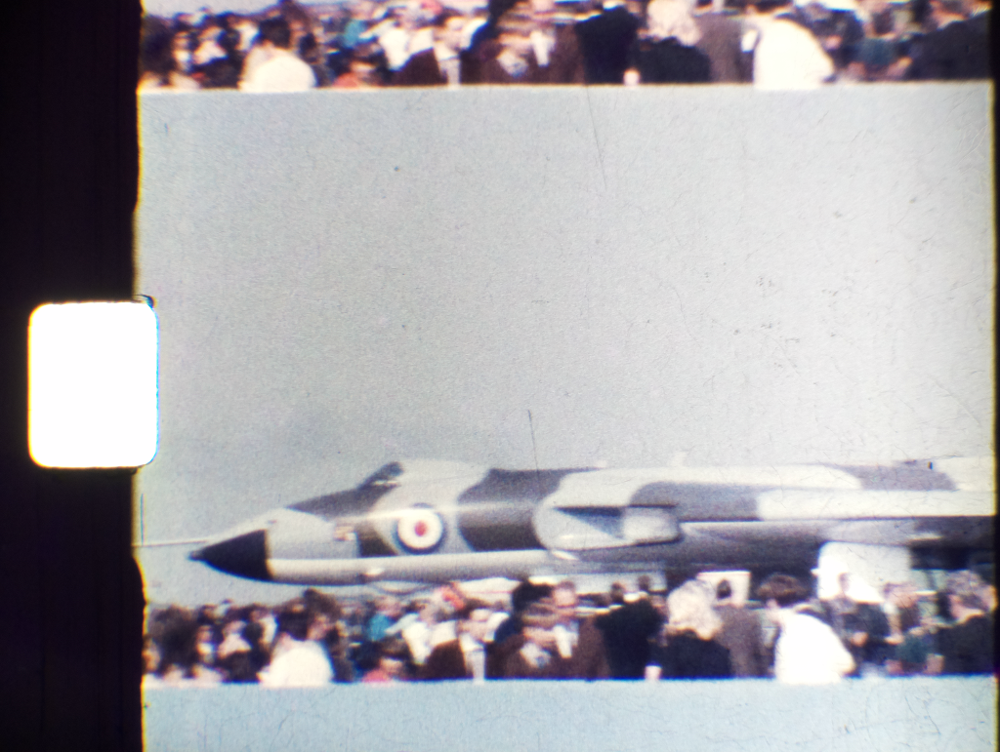

# 3D printed Super 8 Film Scanner

Using OpenCV and Open Source software to scan and create videos from Super 8 film reel, along with a 3D printed frame.

The code and scanner were created quickly to achieve the job of scanning a handful of Super 8 reels at an acceptable quality.

The code is not optimised or user friendly, but pull requests are very welcome!

The code is unlikely to run straight out of the box on your computer/system, it will need minor amendments to folder names/paths etc.


Items needed for this project:
* [Raspberry Pi 4](https://www.raspberrypi.com/products/raspberry-pi-4-model-b/)
* [Pi Advanced 12megapixel Camera](https://www.raspberrypi.com/products/raspberry-pi-high-quality-camera/)
* [Microscope lens for the Raspberry Pi High Quality Camera - 0.12-1.8x](https://shop.pimoroni.com/products/microscope-lens-0-12-1-8x)
* 3D printed frame (files in this repository)
* Two small stepper motors
* RAMPS style motherboard for controlling the stepper motors and running [MARLIN](https://github.com/MarlinFirmware/Marlin)
* MR16 style LED light bulb (5 Watt)

# YouTube video

See the video on how to use/build this device!

# Scanning Process

## Step 1 - Capture full frame masters

On a Raspberry Pi, use the python code in `RasPi_Camera_Super8Scanner.py` to capture all the individual frames to individual BMP files.

This will generate a large number of files (3000+) of significant file size 20+MByte each.  Camera captures approximately 7.5megapixel full images.

Scanning is slow, running around 0.35 frames per second, so a 3 minute reel takes hours.  

Speed was not a critical issue when designing this solution, however the longest delay is capturing the image from the Raspberry Pi camera and then writing the image to disk.

The images captured would look like this (only higher resolution).  Notice you can see the sproket hole and the black border on the right of the image.


## Step 2 - Convert the BMP files to PNG for archiving (Optional)

Not strictly necessary, but using the code in `Compress_Folder_Of_PNGs.py` 

The code copies the BMP files from the Raspberry PI (over a network SMB share) to a desktop machine and saves them to a local disk as PNG images.

This preserves the quality of the image, but a quarter of the disk space is used.

This is a separate step, as the Raspberry Pi scanning is significantly slower if it creates PNG files on the fly.

You will have to configure the Raspberry Pi to expose a network share for you to access from a desktop PC.

You can run this process whilst scanning is operating, to avoid the memory card on the Pi filling up.

The files are put into a folder named "Capture"

## Step 3 - Alignment

Step one captured the full frame of the film, this process takes those master images and accurately crops them to vertically and horizontally align them based on the sproket hole.

OpenCV is used to detect the hole and align/crop the image.

The code is in `ImageRegistrationCropping.py` its likely you will need to tweak the code to cater for the particular file size/resolution you are using and the camera configuration.

Look for the variable `frame_dims` to control the output image dimensions

The files are put into a folder named "Aligned".  Example image.


## Step 4 - Denoise (optional)

A post process called de-noise filtering can be used to improve image quality.  This code can be found in `Denoise.py`

This is a significantly slow process, so a faster CPU helps a lot.  You can tweak the amount of correction made with these values

```
h=3, hColor=3, templateWindowSize=7,searchWindowSize=29
```

For a description of the paramters, check out the [OpenCV documentation](https://docs.opencv.org/3.4/d1/d79/group__photo__denoise.html#gaa501e71f52fb2dc17ff8ca5e7d2d3619).

The files are put into a folder named "Denoise".  Example image.


## Step 5 - Create Video

### FFMPEG
You can use the open source FFMPEG tool to convert a series of pictures into a video, using a command similar to this:
```
ffmpeg.exe -y -start_number 0 -framerate 18 -i "Aligned\frame_%08d.png" -vcodec h264 -preset slower -tune grain -crf 15 -vf "fps=18,format=yuv420p" -r 18 film_output.mp4
```

### Video editor software
Alternatively, use video editing software like [Davinci Resolve](https://www.blackmagicdesign.com/products/davinciresolve/) to import the pictures and generate a video.

This can also be used to colour correct the film, remove noise and grain and generally improve the final video.
