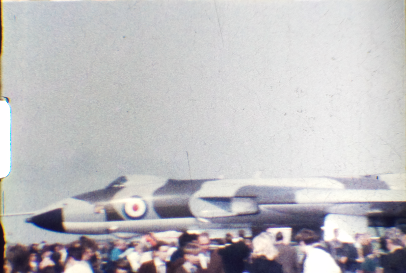

# 3D printed Super 8 Film Scanner

Using OpenCV and Open Source software to scan and create videos from Super 8 film reel, along with a 3D printed frame.

The code and scanner were created quickly to achieve the job of scanning a handful of Super 8 reels at an acceptable quality.

The code is not optimised or user friendly, but pull requests are very welcome!

The code is unlikely to run straight out of the box on your computer/system, it will need minor amendments to folder names/paths etc.


Items needed for this project:
* [Raspberry Pi 4](https://www.raspberrypi.com/products/raspberry-pi-4-model-b/)
* [Pi Advanced 12megapixel Camera](https://www.raspberrypi.com/products/raspberry-pi-high-quality-camera/)
* [Microscope lens for the Raspberry Pi High Quality Camera - 0.12-1.8x](https://shop.pimoroni.com/products/microscope-lens-0-12-1-8x)
* 3D printed frame (files in this repository)
* Two small depth stepper motors (NEMA 17 style)
* RAMPS style motherboard for controlling the stepper motors and running [MARLIN](https://github.com/MarlinFirmware/Marlin)
* MR16 style LED light bulb (5 Watt)

# YouTube video

See the video on how to use and build this device.

https://youtu.be/DWqnX4kHpYg

# Scanning Process

## Step 1 - Capture full frame masters

On a Raspberry Pi (4 is possible), use the python code in `RasPi_Camera_Super8Scanner.py` to capture all the individual frames to individual PNG files.

This will generate a large number of files (3000+) of significant file size 8+MByte each.  Camera captures approximately 7.5megapixel full images.

Scanning is slow, running around 0.4 - 0.5 frames per second, so a 3 minute reel takes 3+ hours.  

Speed was not a critical issue when designing this solution, however the longest delay is capturing the image from the Raspberry Pi camera.

The images captured would look like this (only higher resolution).  Notice you can see the sproket hole and the black border on the right of the image.


## Step 2 - Alignment

Step one captured the full frame of the film, this process takes those master images and accurately crops them to vertically and horizontally align them based on the sproket hole.

OpenCV is used to detect the hole and align/crop the image.

The code is in `ImageRegistrationCropping.py` its likely you will need to tweak the code to cater for the particular file size/resolution you are using and the camera configuration.

Look for the variable `frame_dims` to control the output image dimensions.  Its likely you will also need to change the folder names.

The files are put into a folder named "Aligned".  Example image.


## Step 3 - Denoise (optional)

A post process called de-noise filtering can be used to improve image quality.  This code can be found in `Denoise.py`

This is a significantly slow process, so a faster CPU helps a lot.  You can tweak the amount of correction made with these values

```
h=3, hColor=3, templateWindowSize=7,searchWindowSize=29
```

For a description of the paramters, check out the [OpenCV documentation](https://docs.opencv.org/3.4/d1/d79/group__photo__denoise.html#gaa501e71f52fb2dc17ff8ca5e7d2d3619).

The files are put into a folder named "Denoise".  Example image.


## Step 4 - Create Video

### FFMPEG
You can use the open source FFMPEG tool to convert a series of pictures into a video, using a command similar to this:
```
ffmpeg.exe -y -start_number 0 -framerate 18 -i "Aligned\frame_%08d.png" -vcodec h264 -preset slower -tune grain -crf 15 -vf "fps=18,format=yuv420p" -r 18 film_output.mp4
```

### Video editor software
Alternatively, use video editing software like [Davinci Resolve](https://www.blackmagicdesign.com/products/davinciresolve/) to import the pictures and generate a video.

This can also be used to colour correct the film, remove noise and grain and generally improve the final video.
